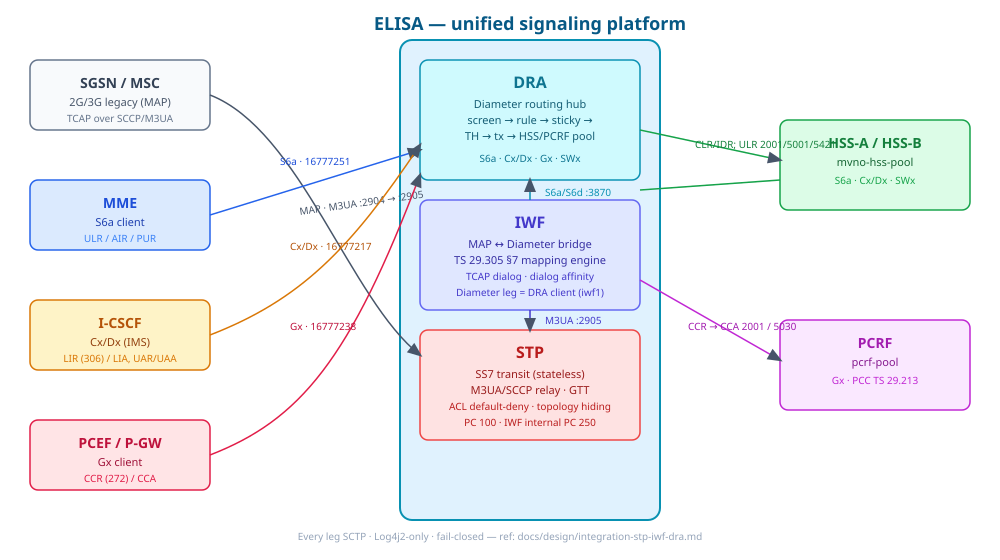
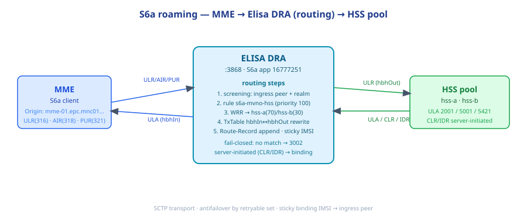
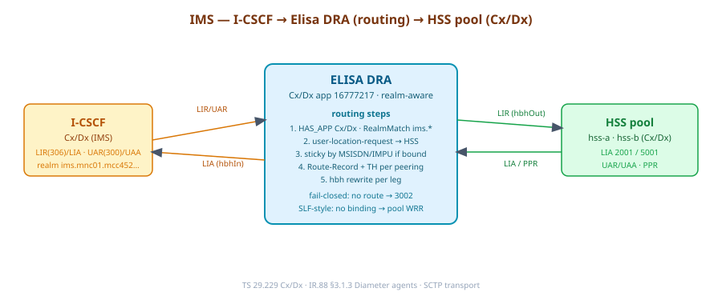
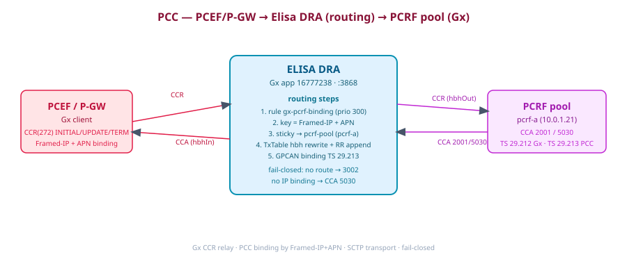

# Lab Scenario — Elisa STP + IWF + DRA (converged routing)

> Scenario lab cho **một platform thống nhất**: Nextgen STP (SS7 transit) +
> IWF (MAP↔Diameter bridge) + Nextgen DRA (Diameter routing hub) — tất cả
> thuộc **Elisa** (`et.elisa:elisa-roaming`). Tài liệu làm việc cho lab
> belt-and-braces: kiểm chứng routing qua Elisa ở chính giữa, MME / I-CSCF /
> PCEF-PCRF đi qua đúng 1 hàng rào duy nhất.
>
> JDK: Java 25 (mise zulu-25). Toàn bộ leg SCTP, Log4j2-only, fail-closed.
> Design tham chiếu: `docs/design/integration-stp-iwf-dra.md`,
> `docs/design/03-dra-routing-rules.md`. Test plan đầy đủ:
> `docs/plans/iwf-e2e-test-plan.md`.

---

## 1. Topology tổng — Elisa ở chính giữa



Điểm cốt lõi: mọi request (MAP legacy, S6a, Cx/Dx, Gx) phải đi **qua Elisa** —
không có đường tắt nào. Elisa gồm 3 khối có đúng một trách nhiệm:

| Khối | Trách nhiệm | Không bao giờ |
|---|---|---|
| **STP** | M3UA/SCCP relay · GTT · ACL default-deny · topology hiding | giữ TCAP dialog |
| **IWF** | TCAP/MAP dialog state · TS 29.305 mapping engine | tự làm routing Diameter |
| **DRA** | screen → rule → sticky → TH → tx · fail-closed 3002 | hiểu MAP |

---

## 2. Scenario A — MME 4G roaming (S6a)



| Bước | Chuyện gì xảy ra | Check |
|---|---|---|
| 1 | MME gửi ULR/AIR/PUR tới Elisa DRA `:3868`, app S6a (16777251), Origin `mme-01.epc.mnc01.mcc452.3gppnetwork.org` | peer `mme-01` ingress, realm epc.* |
| 2 | DRA screening + rule **`s6a-mvno-hss`** (prio 100) match `app=16777251 ∧ IMSI prefix 4520402` | log `[relay] decision Forward` |
| 3 | WRR chọn HSS trong `mvno-hss-pool` (hss-a 70 / hss-b 30) | counter `dra_tx_total{peer=hss-*}` |
| 4 | TxTable gán hbhOut, append Route-Record, sticky `IMSI→{hss, mme-01-link}` | `dra_binding` ghi 1 dòng IMSI |
| 5 | ULA về: lookup TxTable hbhOut→hbhIn, trả lại đúng MME | latency + 2xxx class |

**Server-initiated (HSS → MME):** CLR/IDR từ HSS không Dest-Host →
BindingStore resolve `IMSI → ingressPeerId=mme-01-link` → forward thả xuống
đúng link MME. Không binding và không Dest-Host → **fail-closed 3002**.

---

## 3. Scenario B — IMS I-CSCF (Cx/Dx)



| Bước | Chuyện gì xảy ra | Check |
|---|---|---|
| 1 | I-CSCF gửi LIR/UAR tới DRA, app Cx/Dx (16777217), realm `ims.mnc01.mcc452.3gppnetwork.org` | RealmMatch `ims.*` |
| 2 | Rule engine match theo user (MSISDN/IMPU) → HSS pool | sticky key MSISDN/IMPU |
| 3 | LIA/UAA về đúng ingress I-CSCF qua hbh rewrite | 2001 / 5001 |

Lưu ý HA: DRA không hiểu nội dung IMS; chi routing thuần tuý theo
app/realm/user-key — không phá vendor CSCF.

---

## 4. Scenario C — PCC PCEF ↔ PCRF (Gx)



| Bước | Chuyện gì xảy ra | Check |
|---|---|---|
| 1 | PCEF/P-GW gửi CCR(272) tới DRA, app Gx (16777238) | rule **`gx-pcrf-binding`** prio 300 |
| 2 | Routing key = **Framed-IP + APN** → sticky tới `pcrf-pool` | `GPCAN:<ip>+<apn>` binding TS 29.213 |
| 3 | CCA 2001 khi IP khớp binding; **5030** khi không có binding | policy-rule: không đoán mò |

Toàn bộ qua một cửa DRA — PCRF không bao giờ thấy PCEF khác realm trực tiếp.

---

## 5. Scenario D — Legacy 2G/3G ↔ 4G core (MAP qua IWF)

```
SGSN(MAP) --M3UA :2904--> STP(GTT GT-IWF→PC250/SSN11) --M3UA :2905--> IWF
IWF --S6a/S6d SCTP :3870--> DRA --rule s6a-iwf (prio 110)--> HSS pool
```

IWF là **peer bình thường** của DRA (`iwf1`, group `iwf-access`, app
16777251). ULR từ IWF đi qua rule `s6a-iwf` → forward HSS pool + sticky IMSI;
CLR/IDR server-initiated resolve binding → trả về đúng peer `iwf1` → IWF map
thành MAP `cancelLocation(3)` → STP GTT → SGSN.

| Case | Kết quả |
|---|---|
| HSS trả 2001 | IWF build MAP returnResult `updateGprsLocation` về SGSN |
| HSS trả 5001 | MAP `unknownSubscriber` |
| HSS trả 5421 | MAP `roamingNotAllowed` |
| DRA 3002 / timeout | MAP `systemFailure` |
| HSS down (hết peer) | 3002 retryable → `systemFailure` (không silent-drop) |

---

## 6. Matrix xác minh hàng rào (anti-bypass)

| Cặp | Đường đi hợp lệ | Đường tắt (CẤM) |
|---|---|---|
| MME ↔ HSS | MME → **DRA** → HSS | peer trực tiếp MME↔HSS |
| I-CSCF ↔ HSS | I-CSCF → **DRA** → HSS | thêm peer CSCF vào HSS link |
| PCEF ↔ PCRF | PCEF → **DRA** → PCRF | PCRF nhận CCR ngoài DRA |
| SGSN ↔ HSS | SGSN → **STP** → **IWF** → **DRA** → HSS | IWF thêm link thẳng HSS |

Mọi lab test phải chứng minh request đi qua đúng chuỗi (check cổng
`:2905/:2906/:3870/:3869` và Route-Record trong message log), không chỉ tin
vào UI badge.

---

## 7. Cổng lab (đều loopback)

| Port | Tiến trình | Vai trò |
|---|---|---|
| 2904/2905 | SGSN-sim ↔ STP | M3UA/SCCP MAP leg |
| 2906 | IWF → STP | internal M3UA (PC 250) |
| 3870 | DRA `iwf-acc` | IWF diameter ingress (S6a/S6d) |
| 3868 | DRA `mme-acc` | MME/bench ingress |
| 3869 | HSS testapp | DRA dial-out HSS (CLIENT) |
| 8080 / 8086 | DRA admin / testapp web | kiểm chứng |

---

## 8. Verify checklist nhanh (sau mỗi phiên lab)

```bash
# 1) mọi peer OPEN thật (channel up ∧ CEA ∧ watchdog) — không tin UI một chiều
curl -s :8080/api/peers | jq '.[] | select(.ready!=true)'
# 2) routing log — phải thấy decision Forward/Reject, không silent drop
grep '\[relay\] decision' /tmp/opencode/dra.log | tail -5
# 3) binding hình thành từ ULR
grep -c 'IMSI:' /tmp/opencode/dra.log
# 4) dọn dẹp
pkill -f quarkus-run ; pkill -f sas-diameter-testapp-lab.jar ; pkill -f sgsn-sim
ss -tlnp | grep -E ':(2904|2905|2906|3868|3869|3870|8080|8086)\b' || echo "ALL FREE"
```

> Nguyên tắc nhà: test xanh chưa đóng bài — phải chứng minh live bằng log thật
> và peer status thật.